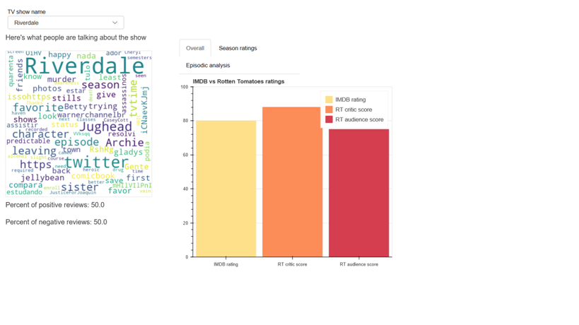
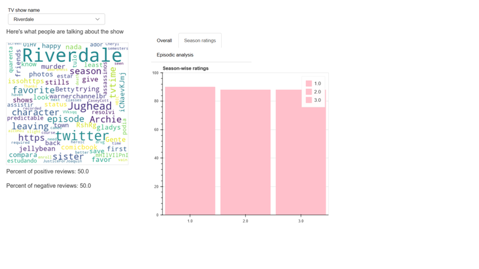
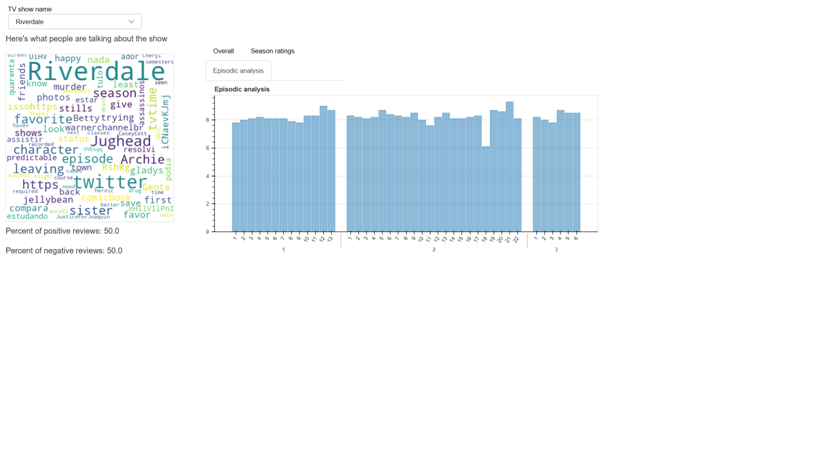

# TV-Show-Review-Analysis

Analysis of tweets for different TV Shows, compared with critics reviews from IMDb and Rotten Tomatoes to give an overall view of each show. Used Twitter API, web scraping, Naive Bayes classifier, and Python with Pandas, Bokeh, and NLTK.  
 
<b>Info:</b>
1) imdbrtoverall.py generates the rtv.csv files which contains the overall imdb and rotten tomatoes ratings of the selected TV shows. 
2) twitter.py generates the twitterdata.csv file which contains reviews of TV shows collected from twitter and their classification into positive and negative. 
3) seasonepiinfo.py generates the season.csv file which contains season-wise and episode-wise ratings of the selected TV show. 

These .csv files are pre-generated and are ready to use.  

<b>Running the Code </b> 

The main.py file is the one that generates the visualization. To run this file, 
1) Make sure the bokeh package is installed on your device. 
2) Open the python terminal within your IDE. Ideally if using Jupyter Notebooks, goto New > Terminal. 
3) Set your path to the current folder where all the files and the main.py file is. 
4) Type the command "bokeh serve --show main.py" without the double quotes. 

The visualization will open up in a new browser window.  

